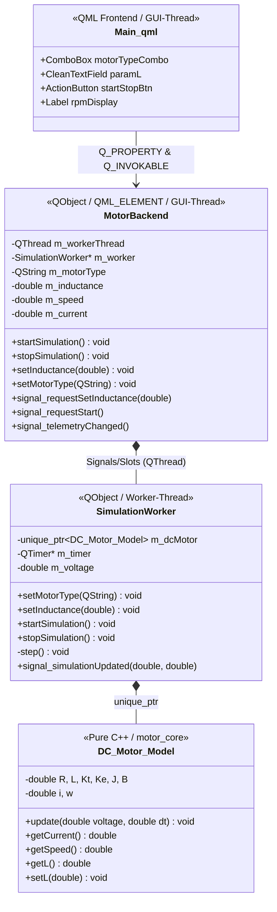

```mermaid
classDiagram
    direction TB

    class Main_qml {
        <<QML Frontend / GUI-Thread>>
        +ComboBox motorTypeCombo
        +CleanTextField paramL
        +ActionButton startStopBtn
        +Label rpmDisplay
    }

    class MotorBackend {
        <<QObject / QML_ELEMENT / GUI-Thread>>
        -QThread m_workerThread
        -SimulationWorker* m_worker
        -QString m_motorType
        -double m_inductance
        -double m_speed
        -double m_current
        +startSimulation() void
        +stopSimulation() void
        +setInductance(double) void
        +setMotorType(QString) void
        +signal_requestSetInductance(double)
        +signal_requestStart()
        +signal_telemetryChanged()
    }

    class SimulationWorker {
        <<QObject / Worker-Thread>>
        -unique_ptr~DC_Motor_Model~ m_dcMotor
        -QTimer* m_timer
        -double m_voltage
        +setMotorType(QString) void
        +setInductance(double) void
        +startSimulation() void
        +stopSimulation() void
        -step() void
        +signal_simulationUpdated(double, double)
    }

    class DC_Motor_Model {
        <<Pure C++ / motor_core>>
        -double R, L, Kt, Ke, J, B
        -double i, w
        +update(double voltage, double dt) void
        +getCurrent() double
        +getSpeed() double
        +getL() double
        +setL(double) void
    }

    Main_qml --> MotorBackend : Q_PROPERTY & Q_INVOKABLE
    MotorBackend *-- SimulationWorker : Signals/Slots (QThread)
    SimulationWorker *-- DC_Motor_Model : unique_ptr
```